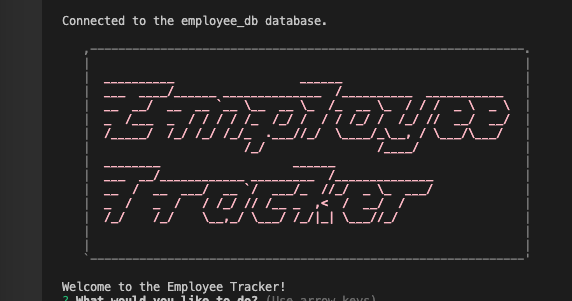
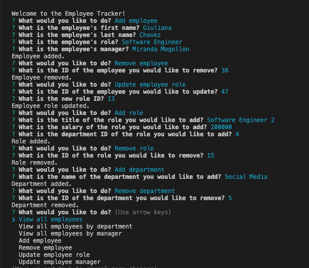
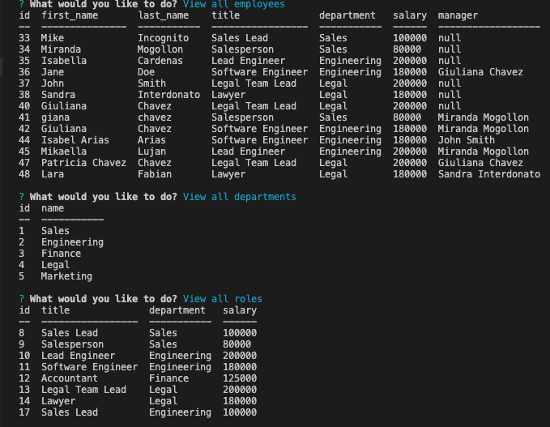
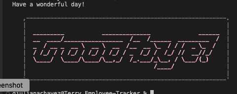

## Description
       

  
   This app stores and organices data for managment systems. This application uses `Node.js`, `Inquirer`, and `MySQL` to interact with a MySQL database which will allow a devoloper to manipulate it within each table by adding, updating, and deleting data.
   
   Link to demo video: https://drive.google.com/file/d/1Gs2qQay_57MosGR2JEcy7hjdgaqnd2r9/view

## Screenshot

|      Welcome     |   Prompts  |
|------------------|------------|
||
|       Tables     |     End    |
|------------------|------------|
||

## Table of Contents
  - [Description](#Description)
  - [Installation](#Installation)
  - [Usage](#Usage)
  - [Contribution](#Contribution)
  - [License](#License)
 

## Techonologies
* [JavaScript](https://developer.mozilla.org/en-US/docs/Web/JavaScript)
* [Express.js](https://expressjs.com/)
* [Node.js](https://nodejs.org/en/)
* [MySQL](https://www.mysql.com/)
* [MySQL2](https://www.npmjs.com/package/mysql2#installation)
* [dotenv](https://www.npmjs.com/package/dotenv)
* [console.table](https://www.npmjs.com/package/console.table)
* [Inquirer](https://www.npmjs.com/package/inquirer)

## Installation 
* To install all the dependencies that you need you have to run the following command: `npm i`
* In order to use this application you must clone the repository on your local machine.
* Make sure that your repo includes a `MySQL2 package` to connect to your MySQL database and perform queries, the `Inquirer package` to interact with the user via the command line, and the `console.table package` to print MySQL rows to the console.
* You also want to make your queries asynchronous. MySQL2 exposes a `.promise()` function on Connections to upgrade an existing non-Promise connection to use Promises.

## Usage
After installing all the require dependencies you can proceed to:
* Type `node index.js` or `npm start` in your terminal and follow the prompts!

## Contribution
For questions please reach me at: giuliana@gmail.com  
My Github: [Giuliana](https://github.com/gj3chavez)

## License
  
  
  Copyright (c) 2023 gj3chavez

Permission is hereby granted, free of charge, to any person obtaining a copy
of this software and associated documentation files (the "Software"), to deal
in the Software without restriction, including without limitation the rights
to use, copy, modify, merge, publish, distribute, sublicense, and/or sell
copies of the Software, and to permit persons to whom the Software is
furnished to do so, subject to the following conditions:

The above copyright notice and this permission notice shall be included in all
copies or substantial portions of the Software.

THE SOFTWARE IS PROVIDED "AS IS", WITHOUT WARRANTY OF ANY KIND, EXPRESS OR
IMPLIED, INCLUDING BUT NOT LIMITED TO THE WARRANTIES OF MERCHANTABILITY,
FITNESS FOR A PARTICULAR PURPOSE AND NONINFRINGEMENT. IN NO EVENT SHALL THE
AUTHORS OR COPYRIGHT HOLDERS BE LIABLE FOR ANY CLAIM, DAMAGES OR OTHER
LIABILITY, WHETHER IN AN ACTION OF CONTRACT, TORT OR OTHERWISE, ARISING FROM,
OUT OF OR IN CONNECTION WITH THE SOFTWARE OR THE USE OR OTHER DEALINGS IN THE
SOFTWARE.